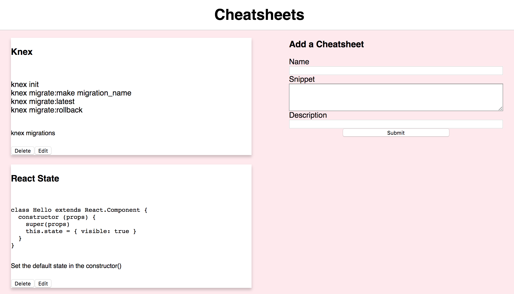

# Cheatsheets

## 

## [Live Site](https://cheatsheets-6b13a.firebaseapp.com/)

This cheatsheets application enables people to access helpful snippets in a wide range of topics from installing Knex to important React concepts along with a brief description of what the snippet is meant for. It also allows users to add their own snippets.

## [Back end repo](https://cheetsheets.herokuapp.com/sheets)

## Installation:

> -Clone this repo.

> -run `npm install`

> -run 'npm start' to run locally
